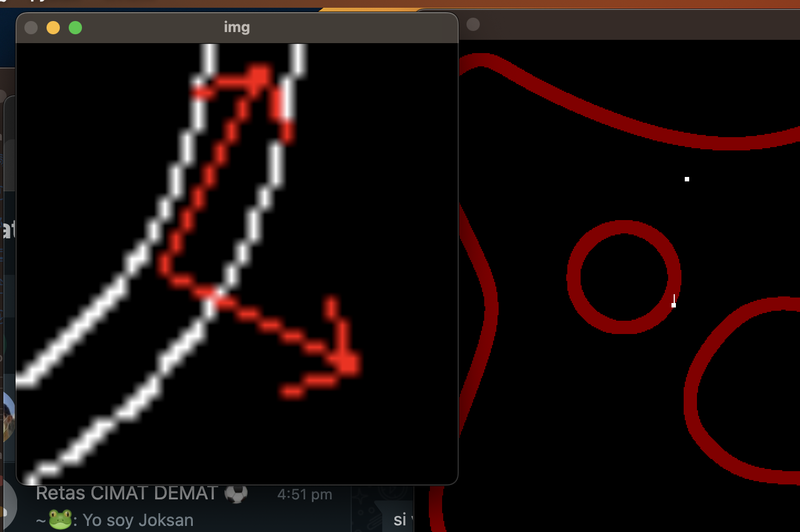

<style>
    figure {
        display: block;
        margin-left: auto;
        margin-right: auto;
        width: 70%;
    }
    figure img {
        vertical-align: top;
    }
    figure figcaption {
        text-align: center;
    }
</style>

# TangentBug

Emmanuel Larralde

## Sobre el algoritmo

La familia de algortimos insecto (*Bug algorithms*)  navegan un robot de dos grados de libertad en un ambiente completamente desconocido usando sensores.

El algoritmo `TangentBug` navega un robot punto en un ambiente planar con obstáculos estacionarios. Se considera que el robot es capaz de conocer su posición local $p$ y la distancia de $p$ a los obstáculos dentro de un rango de detección $R$, además de que sabe en dónde se encuentra el obstáculo.

El algoritmo es el siguiente:

1. Moverse a la dirección del objetivo hasta que uno de los siguientes eventos suceda:

- El objetivo es **alcanzado**. Termina.
- Un mínimo local (obstáculo) es alcanzado. Ve a paso 2.

2. Moverse a lo largo del contorno del obstáculo mientras que se registra la distancia mínima al objetivo, hasta que uno de los siguientes eventos ocurre:
- El objetivo es **alcanzado**. Termina.
- Existe un punto en el que puede abandonar el obstáculo ($V_{leave}$) y la distancia es menor a la registrada. Ve a paso 3.
- El robot completó una vuelta sobre el obstáculo. El objetivo es **inalcanzable**. Termina.

3. Dirigirse a $V_{leave}$ donde la distancia es menor. Regresar al paso 1.


## Sobre la implementación

El robot conoce con precisión su posición y la del objetivo. Tiene un sensor de rango limitado que le permite determinar si hay un camino libre de longitud a lo mucho $R$ en dirección al objetivo. Para corroborar visualmente que funciona el sensor de rango, se grafica siempre el camino antes de incidir con un obstáculo hacia el objetivo. Así, si el sensor de rango determina que no hay obstáculo (y no hay un seguimiento de contorno en proceso), el robot se dirige hacia el objetivo.

Para hacer el seguimiento de contorno se implementó una cámara que apunta hacia el suelo. Usando detección de bordes de Canny y un ajuste de rectas, el robot puede calcular dos vectores: uno que le indica a que dirección debe dirigirse para seguir el contorno y otro de repulsión que lo mantiene suficientemente alejado (evitar colisiones) del contorno.


<figure>
    
    <figcaption>
        Ambiente de simulación. A la izquierda se muestra la imagen procesada de la cámara.
    </figcaption>
</figure>

El modelo cinemático del robot es el de una partícula de velocidad constante. Usando una velocidad constante para seguir el contorno y otra para dirigirse hacia el objetivo.

Sea $\hat v$ el vector unitario calculado que expresa la dirección que debe seguir el robot, entonces:

$$
    x_{k+1} = x_k + v_{const} \hat v_x dt \\
    y_{k+1} = y_k + v_{const} \hat v_y dt 
$$

## Sobre el software

El simulador se programó usando python. La ventana principal es manejada por `pygame`, pero el renderizado se logra através de instrucciones de `OpenGL`. Los algoritmos de visión y la visualización de la imágen de la cámara se logra a través de `OpenCV`.

### Instalación

1. Clona el repositorio:

```sh
git clone https://github.com/L4rralde/tangent_bug.git
cd tangent_bug
```

2. (Opcional) Usa un ambiente virtual de python

```sh
python -m venv .venv
source .venv/bin/activate
```

3. Instala las dependencias

```sh
pip intstall -r requirements.txt
```

### Uso

Revisando una porción del código:

```python
def main():
    svg_path = f"{GIT_ROOT}/media/mundo_circ.jpg"
    origin = Robot(-0.7, 0.5)
    goal = Point(0.45, 0.35)
    scene = ParticleSvgScene("Tangent Bug", svg_path, 20, origin, goal)
    scene.run()
```

- Modifica `svg_path` si quieres usar ontro ambiente, en el directorio `media/` encontrarás varias imágenes `*.jpg` que funcionan como ambientes.

- Modifica las coordenadas en `Robot()` si quieres modificar la posición original del robot.

- Modifica las coordenadas en `goal = Point()` si quieres modificar las coordenadas de la meta.

Estas coordenadas están normalizadas, i.e., $x \in [-1, 1]$, $y \in [-1, 1]$.


## Trabajo futuro

Sería interesante implementar este mismo enfoque (con visión para el segumiento de contornos) en simuladores más adhocs como `Gazebo`.


